<p align="center">
  
</p>

<h1 align="center">Jhonatan Gonzaga</h1>

<p align="center">
  Estudante do 4º período de Engenharia de Software na UFAM, com interesse em Visão Computacional, Inteligência Artificial e Segmentação de Imagens.
</p>

<p align="center">
  <a href="https://github.com/jhonatan-gonzaga">
    
  </a>
  
  
</p>

<p align="center">
  
</p>

## Sobre mim

Sou estudante de Engenharia de Software na Universidade Federal do Amazonas. Minha área de interesse em visão computacional está ligada à segmentação de imagens: separar regiões, identificar classes visuais e transformar pixels em informação útil.

No GitHub, organizo estudos e projetos acadêmicos em linguagens como TypeScript, Python, C, JavaScript e HTML. Quero construir uma base sólida para criar aplicações que trabalhem com imagens, dados e interfaces fáceis de acompanhar.

## Foco técnico

```txt
camera/frame
    |
    v
pre-processamento -> segmentacao -> mascara por classe
    |                               |
    v                               v
imagem limpa                    contornos e metricas
```

- Segmentação de imagens como foco dentro de visão computacional.
- Preparação de dados visuais, máscaras e leitura de resultados.
- Boas práticas de Engenharia de Software em projetos de IA.
- Interfaces para visualizar inferências, contornos, métricas e protótipos.

## Tecnologias no meu GitHub

<p align="left">
  
  
  
  
  
</p>

<p align="left">
  
  
  
</p>

## Projetos públicos

O painel abaixo é regenerado automaticamente por GitHub Actions a partir dos dados públicos do perfil.

<p align="center">
  
</p>

<table>
  <tr>
    <td width="50%">
      <a href="https://github.com/jhonatan-gonzaga/projeto-pratico-es"><strong>projeto-pratico-es</strong></a><br />
      <sub>Projeto acadêmico em TypeScript para prática de Engenharia de Software.</sub><br /><br />
      <code>TypeScript</code>
    </td>
    <td width="50%">
      <a href="https://github.com/jhonatan-gonzaga/projeto-embarcados"><strong>projeto-embarcados</strong></a><br />
      <sub>Projeto acadêmico em Python ligado a sistemas embarcados.</sub><br /><br />
      <code>Python</code>
    </td>
  </tr>
  <tr>
    <td width="50%">
      <a href="https://github.com/jhonatan-gonzaga/COI"><strong>COI</strong></a><br />
      <sub>Repositório público em HTML.</sub><br /><br />
      <code>HTML</code>
    </td>
    <td width="50%">
      <a href="https://github.com/jhonatan-gonzaga/PROGRAMA-O_ORIENTADA_A_OBJETOS"><strong>PROGRAMA-O_ORIENTADA_A_OBJETOS</strong></a><br />
      <sub>Estudos de programação orientada a objetos em Python.</sub><br /><br />
      <code>Python</code>
    </td>
  </tr>
  <tr>
    <td width="50%">
      <a href="https://github.com/jhonatan-gonzaga/trabalho-de-SO"><strong>trabalho-de-SO</strong></a><br />
      <sub>Trabalho acadêmico em JavaScript.</sub><br /><br />
      <code>JavaScript</code>
    </td>
    <td width="50%">
      <a href="https://github.com/jhonatan-gonzaga/questionario-UEQ-SUS"><strong>questionario-UEQ-SUS</strong></a><br />
      <sub>Questionário UEQ/SUS em HTML.</sub><br /><br />
      <code>HTML</code>
    </td>
  </tr>
</table>

## Contato

Você pode acompanhar meus projetos e estudos pelo GitHub:

<p align="left">
  <a href="https://github.com/jhonatan-gonzaga">
    
  </a>
</p>
